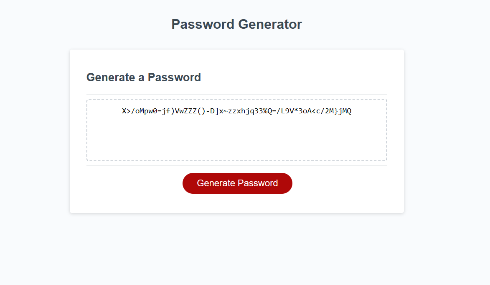

JavaScript: Password Generator ( Challenge 3)

## Description

I was tasked with my thrid challenge to make a Password Generator.

- I used W3school and youtube to assist me on completing this challenge.
- I was able to problem solve and fix code.
- I learned how to fix typeErrors (ended up changing out var to let as it caused errors).
- I made the css look nicer than default 

I followed the criteria below provided by the class instructors.

## User Story

- AS AN employee with access to sensitive data
- I WANT to randomly generate a password that meets certain criteria
- SO THAT I can create a strong password that provides greater security

## Acceptance Criteria

- GIVEN I need a new, secure password
- WHEN I click the button to generate a password
- THEN I am presented with a series of prompts for password criteria
- WHEN prompted for password criteria
- THEN I select which criteria to include in the password
- WHEN prompted for the length of the password
- THEN I choose a length of at least 8 characters and no more than 128 characters
- WHEN asked for character types to include in the password
- THEN I confirm whether or not to include lowercase, uppercase, numeric, and/or special characters
- WHEN I answer each prompt
- THEN my input should be validated and at least one character type should be selected
- WHEN all prompts are answered
- THEN a password is generated that matches the selected criteria
- WHEN the password is generated
- THEN the password is either displayed in an alert or written to the page

 **Note**: I hope its ok I changed the look of the generator its pretty bland hahah. I will include a before and after picture so you can see the style changes after the last push.

## Mock-Up

The following image shows the web application after I edited the code.

**Note**: This image is a screen shot once i finished the assisnment , styled by defaulted code.

**Note**: This image is a screen shot after adjusting the css to add my touch  (hope thats ok).

## Credits
- https://www.youtube.com/watch?v=XH7CzSZ-9gY
- https://www.youtube.com/watch?v=x4HUaiazDes
- https://www.w3schools.com/
- https://scrollrevealjs.org/

**Note**: I am struggling with JavaScript , this assignment took me 5 days and alot of help from W3school and Youtube to even get close to this outcome.....following along and typing things out is the only reason I understand whats going on.

**Note**: User story and acceptance criteria was provided to me in class
 UNB-VIRT-FSF-PT-04-2023-U-LOLC for Week 3 Challenge. 

## My Github

- https://github.com/xNoirNightx/Password-Generator

## License

N/A